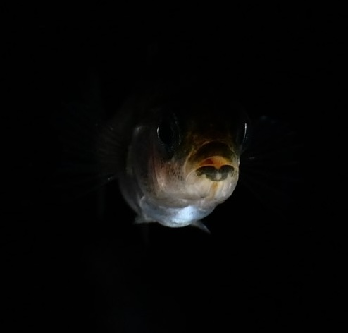
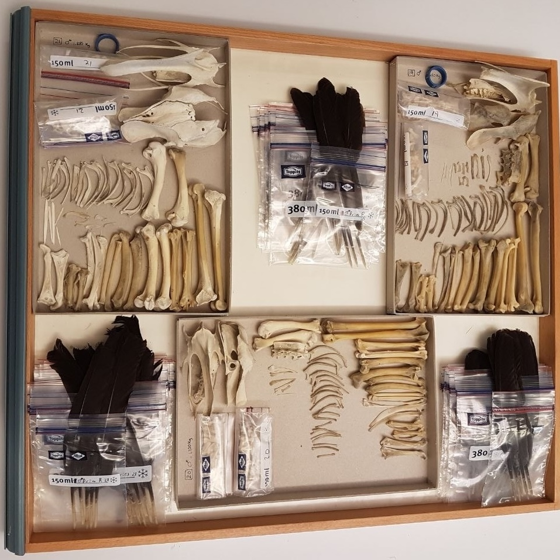
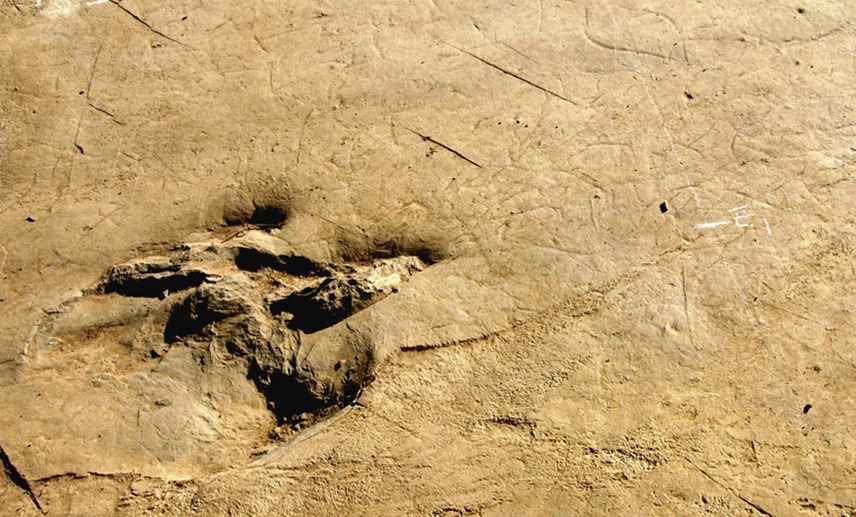
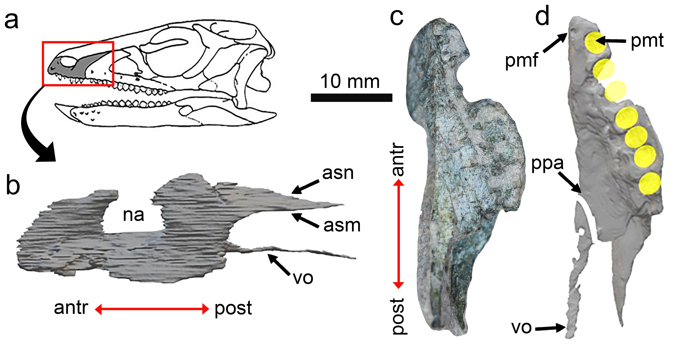

## Articles

::: {.pub-grid-3}

::: {.pub-card}

::: {.pub-entry}

**Evolution of threespine stickleback dorsal spines via *hoxdb* gene regulation.**

**Herrera-Castillo, Carlos Manuel**, Brechbühl, Tanja, Fages, Antoine, Louise Dean, Laura, Tschopp, Patrick, MacColl, Andrew, Berner, Daniel

*bioRxiv* · 2025

[ doi.org/10.1101/2025.08.04.667941](https://doi.org/10.1101/2025.08.04.667941){.doi-link}

:::

:::

::: {.pub-card}

::: {.pub-entry}

**Skeletal variation in bird domestication: limb proportions and sternum in chicken, with comparisons to mallard ducks and Muscovy ducks.**

**Herrera-Castillo, Carlos Manuel**, Geiger, Madeleine, Núñez-León, Daniel, Nagashima, Hiroshi, Gebhardt-Henrich, Sabine, Toscano, Michael, Sanchez-Villagra, Marcelo R.

*PeerJ* · 2022

[ doi.org/10.7717/peerj.13229](https://doi.org/10.7717/peerj.13229){.doi-link}

:::

:::

::: {.pub-card}

::: {.pub-entry}

**A theropod trackway providing evidence of a pathological foot from the exceptional locality of Las Hoyas (upper Barremian, Serranía de Cuenca, Spain).**

**Herrera-Castillo, Carlos Manuel**, Moratalla, José J., Belaústegui, Zain, Marugán-Lobón, Jesús, Martín-Abad, Hugo, Nebreda, Sergio M., López-Archilla, Ana I., Buscalioni, Ángela D.

*PLOS ONE* · 2022

[ doi.org/10.1371/journal.pone.0264406](https://doi.org/10.1371/journal.pone.0264406){.doi-link}

:::

:::

::: {.pub-card}

::: {.pub-entry}

**Non-invasive imaging reveals new cranial element of the basal ornithischian dinosaur *Laquintasaura venezuelae*, Early Jurassic of Venezuela.**

**Herrera-Castillo, Carlos Manuel**, Carrillo-Briceño, Jorge D., Sánchez-Villagra, Marcelo R.

*ANARTIA* · 2021

[ doi.org/10.5167/uzh-208139](https://doi.org/10.5167/uzh-208139){.doi-link}

:::

:::

:::

---

## Expected Publications

::: {.callout-note appearance="minimal" icon=false}
###  In preparation · Expected August 2026

**Developmental genetic basis of pelvic armor reduction in acidic-adapted threespine stickleback fish**  
**Herrera-Castillo, Carlos Manuel**, Brechbühl, Tanja, Fages, Antoine, Tschopp, Patrick, MacColl, Andrew, Berner, Daniel

**Assessing sticklebacks as potential vectors of *Pasteuria ramosa* parasitism in *Daphnia magna*: A case study on gut passage survival and transmission**  
Lampadaridis, Nikolaos, **Herrera-Castillo, Carlos Manuel**, Ebert, Dieter
:::

---

## Peer Review Activity

Reviewer for *Molecular Ecology*
