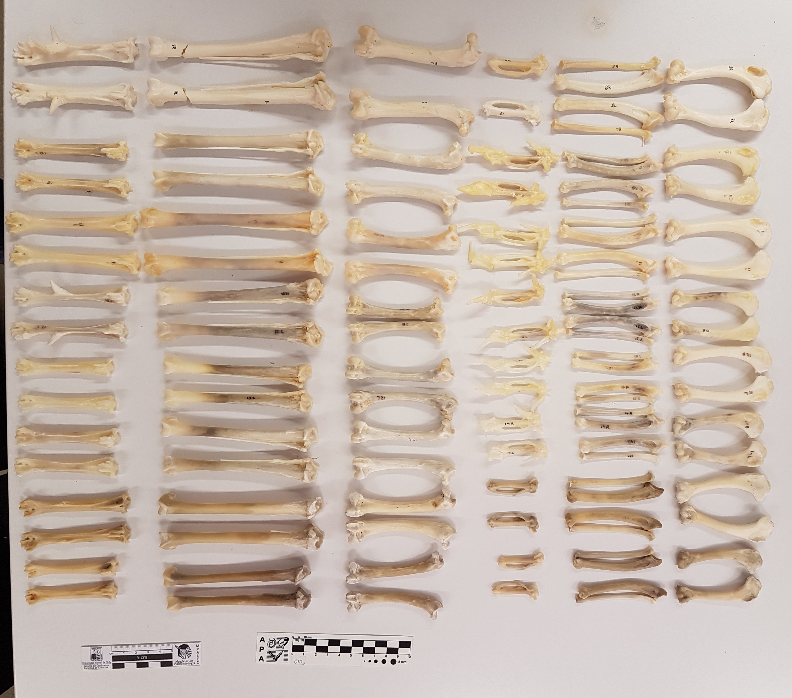
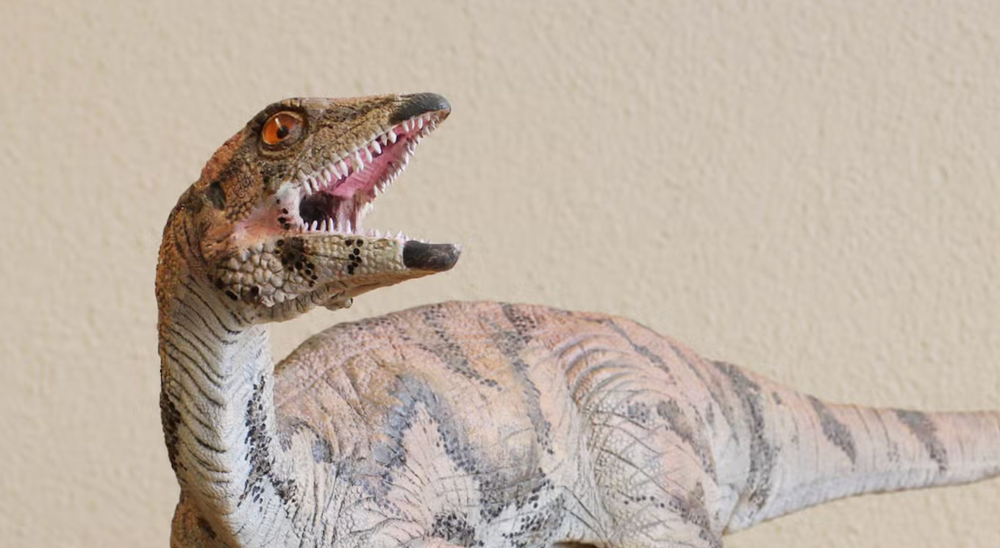

My work combines evolutionary biology, comparative morphology, and functional genomics to understand how complex phenotypes arise and are modified over evolutionary time. I primarily use threespine stickleback fish as a model system, complemented by earlier projects in vertebrate palaeontology and bird domestication.

## Current Research

::: {.research-grid}

::: {.pub-card .research-card-full}

::: {.pub-entry}

**Genomic and developmental adaptation in three-spined sticklebacks**

**PhD research** · Department of Environmental Sciences, Universität Basel · *June 2021 – September 2025*  
Supervised by Dr. Daniel Berner

Identifying the regulatory and coding mechanisms underlying morphological adaptation in stickleback fish, combining large-scale genomics, multi-omics approaches, and experimental genetics.

- Processed large-scale genomic datasets on HPC clusters
- Designed and executed complementation crosses to test candidate loci
- Identified developmental divergence stages via skeletal double-staining
- Performed tissue sampling for bulk RNA-seq, single-cell RNA-seq, and single-cell ATAC-seq
- Integrated multi-omics data to identify candidate regulatory elements underlying morphological trait loss

:::

:::

:::

---

## Past Research

::: {.research-grid}

::: {.pub-card}

::: {.pub-entry}

**Domestication and Development in Birds**

**MSc Project 1** · Paläontologisches Institut, Universität Zürich · *2019 – 2021*  
Supervised by Prof. Dr. Marcelo Sánchez-Villagra

Investigated how domestication affects morphological development in domestic birds, with a focus on skeletal variation in chickens compared to mallard and Muscovy ducks. Combined 2D/3D X-ray imaging, whole-mount skeletal staining, landmark selection, and Procrustes morphometrics.

:::

:::

::: {.pub-card}

::: {.pub-entry}

**Fossil Description of *Laquintasaura venezuelae***

**MSc Project 2** · Paläontologisches Institut, Universität Zürich · *2019 – 2021*  
Supervised by Prof. Dr. Marcelo Sánchez-Villagra

Described newly recovered fossil material from the early ornithischian dinosaur *Laquintasaura venezuelae* (Early Jurassic, Venezuela), including the first non-invasive imaging of a previously undescribed cranial element.

:::

:::

:::

---

## Technical Skills

::: {.grid}
::: {.g-col-12 .g-col-md-6}
**Molecular & Wet Lab**

- Sample fixation, DNA and RNA extraction
- PCR, electrophoresis QC, library preparation
- Ion chromatography, enzymatic kinetics
- Northern, Southern, and Western blotting
- Whole-mount skeletal staining
:::
::: {.g-col-12 .g-col-md-6}
**Computational & Imaging**

- R (genomic & transcriptomic pipelines)
- STAR align (RNA-seq), NovoAlign, bwa-mem2 (genomic aligners)
- AlphaFold (protein structure prediction)
- Mimics (3D scan processing)
- High-Performance Computing (HPC)
- scRNA-seq + scATAC-seq analysis
- 2D/3D X-ray imaging, Procrustes morphometrics
:::
:::
